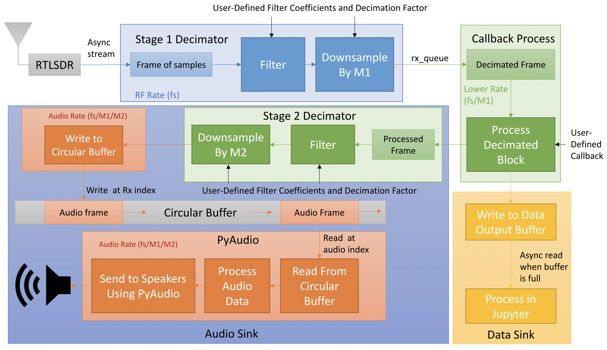
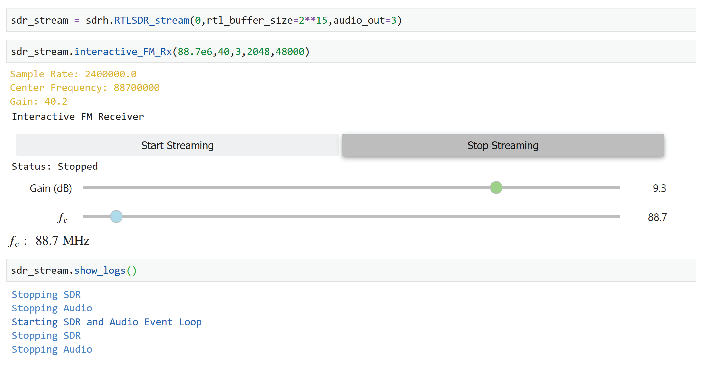

# scikit-dsp-comm

[](https://pypi.python.org/pypi/scikit-dsp-comm)
[](http://scikit-dsp-comm.readthedocs.io/en/latest/?badge=latest)

### New RTL-SDR streaming added!
Feature story at the end of the readme. The docs have been failing to build since mid July as result of trying to include a Jupyter notebook example of an RTLSDR streaming example. Hopefully this will be resolved very soon. 

## Background

 The origin of this package comes from the writing the book Signals and Systems for Dummies, published by Wiley in 2013. The original module for this book is named `ssd.py`. In `scikit-dsp-comm` this module is renamed to `sigsys.py` to better reflect the fact that signal processing and communications theory is founded in signals and systems, a traditional subject in electrical engineering curricula.

## Package High Level Overview

This package is a collection of functions and classes to support signal processing and communications theory teaching and research. The foundation for this package is `scipy.signal`. The code in particular currently requires Python `>=3.5x`.


The real-time audio DSP capabilities of `pyaudio_helper` allow for two channel algorithm development with real-time user control enabled by the `ipywidgets` when running in the Jupyter notebook.

Finally, we now can utilize the real-time DSP capabilities of `pyaudio_helper` to work in combination with streaming of I/Q samples using new functions `rtlsdr_helper`. This allows in particular demodulation of radio signals and downsampling to baseband analog signals for streaming playback of say an FM broadcast station. This new capability is featured as a short *article* at the end of this readme file.


**There are presently ten modules that make up scikit-dsp-comm:**

1. `sigsys.py` for basic signals and systems functions both continuous-time and discrete-time, including graphical display tools such as pole-zero plots, up-sampling and down-sampling.

2. `digitalcomm.py` for digital modulation theory components, including asynchronous resampling and variable time delay functions, both useful in advanced modem testing.

3. `synchronization.py` which contains phase-locked loop simulation functions and functions for carrier and phase synchronization of digital communications waveforms.

4. `fec_conv.py` for the generation rate one-half and one-third convolutional codes and soft decision Viterbi algorithm decoding, including soft and hard decisions, trellis and trellis-traceback display functions, and puncturing.

5. `fir_design_helper.py` which for easy design of lowpass, highpass, bandpass, and bandstop filters using the Kaiser window and equal-ripple designs, also includes a list plotting function for easily comparing magnitude, phase, and group delay frequency responses.

6. `iir_design_helper.py` which for easy design of lowpass, highpass, bandpass, and bandstop filters using scipy.signal Butterworth, Chebyshev I and II, and elliptical designs, including the use of the cascade of second-order sections (SOS) topology from scipy.signal, also includes a list plotting function for easily comparing of magnitude, phase, and group delay frequency responses.

7. `multirate.py` that encapsulate digital filters into objects for filtering, interpolation by an integer factor, and decimation by an integer factor.

8. `coeff2header.py` write `C/C++` header files for FIR and IIR filters implemented in `C/C++`, using the cascade of second-order section representation for the IIR case. This last module find use in real-time signal processing on embedded systems, but can be used for simulation models in `C/C++`.

Presently the collection of modules contains about 125 functions and classes. The authors/maintainers are working to get more detailed documentation in place.

### Extras

This package contains the helper modules `rtlsdr_helper`, and `pyaudio_helper` which require the packages [pyrtlsdr](https://pypi.python.org/pypi/pyrtlsdr) and [PyAudio](https://pypi.python.org/pypi/PyAudio). To use the full functionality of these helpers, install the package from the scikit-dsp-comm folder as follows:\
```
pip install -e .[helpers]
```
Installation is described in greater detail below.

1. `pyaudio_helper.py` wraps a class around the code required in `PyAudio` (wraps the C++ library `PortAudio`) to set up a non-blocking audio input/output stream. The user only has to write the callback function to implement real-time DSP processing using any of the input/output devices available on the platform. This resulting object also contains a capture buffer for use in post processing and a timing markers for assessing the processing time utilized by the callback function. When developing apps in the Jupyter Notebook there is support for the `IPywidgets` along with threading. 

2. `rtlsdr_helper.py` interfaces with `pyrtldsr` to provide a simple captures means for complex baseband software defined radio (SDR) samples from the low-cost (~$20) RTL-SDR USB hardware dongle. The remaining functions in this module support the implementation of demodulators for FM modulation and examples of complete receivers for FM mono, FM stereo, and tools for FSK demodulation, including bit synchronization. Real-time streaming is a new capability included.


## Documentation
Documentation is now housed on `readthedocs` which you can get to by clicking the docs badge near the top of this `README`. Example notebooks can be viewed on [GitHub pages](https://mwickert.github.io/scikit-dsp-comm/). In time more notebook postings will be extracted from [Dr. Wickert's Info Center](http://www.eas.uccs.edu/~mwickert/).

## Getting Set-up on Your System

The best way to use this package is to clone this repository and then install it. 

```bash
git clone https://github.com/mwickert/scikit-dsp-comm.git
```

There are package dependencies for some modules that you may want to avoid. Specifically these are whenever hardware interfacing is involved. Specific hardware and software configuration details are discussed in [wiki pages](https://github.com/mwickert/SP-Comm-Tutorial-using-scikit-dsp-comm/wiki).

For Windows users `pip` install takes care of almost everything. I assume below you have Python on your path, so for example with [Anaconda](https://www.anaconda.com/download/#macos), I suggest letting the installer set these paths up for you.

### Dependencies for `pyaudio`

Across the three popular platforms, Windows, macOS, and Linux, `pyaudio`, is 
the underlying framework that `pyaudio_helper` relies upon. Getting `PyAudio` configured is  different for all three OS's. Conda and CondaForge have support for installing `pyaudio` 
on both Linux and Windows. Under Python 3.6 and below PyAudio will install when `pip` installing the scikit-dsp-comm package, as described below. For Python 3.7+ `PyAudio` **first** needs to be installed using `conda install pyaudio` to obtain binary (`whl`) files.

All the capability of the package is available less `PyAudio` and the RTL-SDR radio, without doing any special installations. See the [wiki pages](https://github.com/mwickert/SP-Comm-Tutorial-using-scikit-dsp-comm/wiki) for more information. Just keep in mind that now a Python 3.7+ install on windows must include the installation `PyAudio` as described above.

### Editable Install with Dependencies

With the terminal in the root directory of the cloned repo perform an editable `pip` install using

```bash
pip install -e .[helpers]
```

### Editable Install without Dependencies

To install without the PyAudio and RTL-SDR dependency, and hence not be able to use those modules,

```bash
pip install -e .
```

### Why an Editable Install?

The advantage of the editable `pip` install is that it is very easy to keep `scikit-dsp-comm ` up to date. If you know that updates have been pushed to the master branch, you simply go to your local repo folder and

```bash
git pull origin master
```

This will update you local repo and automatically update the Python install without the need to run `pip` again. **Note**: If you have any Python kernels running, such as a Jupyter Notebook, you will need to restart the kernel to insure any module changes get reloaded.

------

## Feature: Added Software Defined Radio Streaming to `rtlsdr_helper` with Interface to `pyaudio_helper`
A recent push to the master branch now allows real-time SDR streaming from the RTL-SDR to `pyaudio_helper`. In this first release of the API, the system block diagram takes the from shown in the figure below:



This capability is made possible via the new `aynch` and `await` capabilities of Python 3.7. For the details as to how this works you have to dig into the details found in the module `rtlsdr_helper.py` and the examples found in the notebook `rtlsdr_helper_streaming_sample.ipynb`. A screenshot from the sample Jupyter notebook, that implements a broadcast FM receiver, is shown below:

 

This is just the beginning of making a complete SDR receiver possible in a Jupyter notebook. Not only is the receiver a reality, the algorithms that implement the receiver, in Python, can easily be coded by the user.

To help develop demodulator algorithms a streaming code block interface standard, of sorts, is being developed this summer. The idea is to provide examples of how to write a simple Python class that will manage states in the DSP code that is inside the *Callback Process* block of the block diagram. More details by the end of the summer is expected, along with another sample notebook.